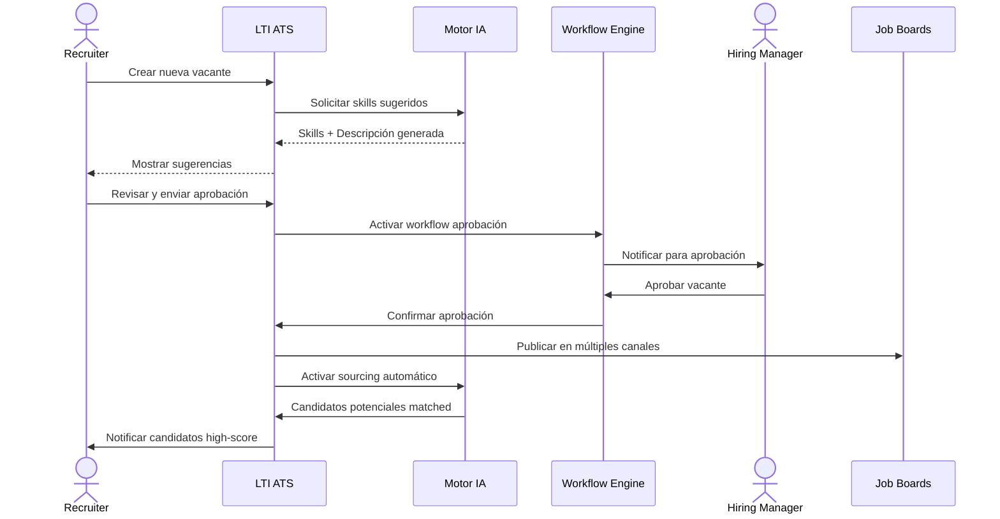
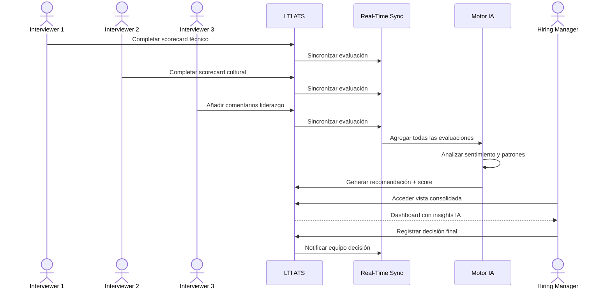
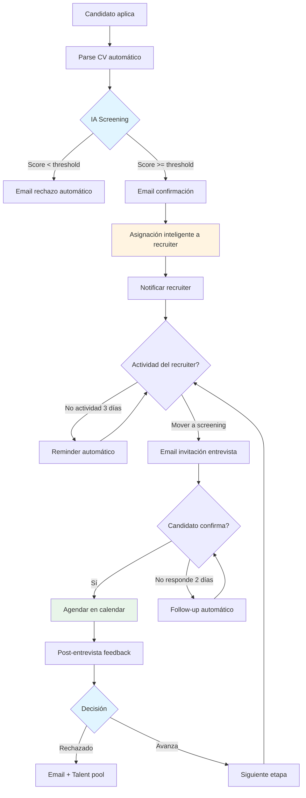
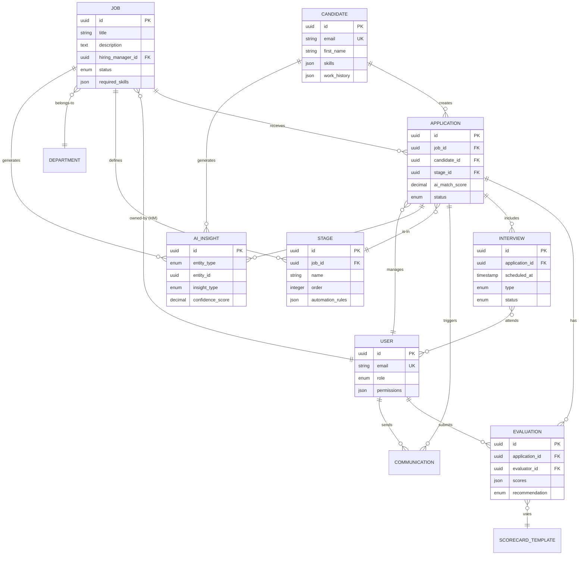
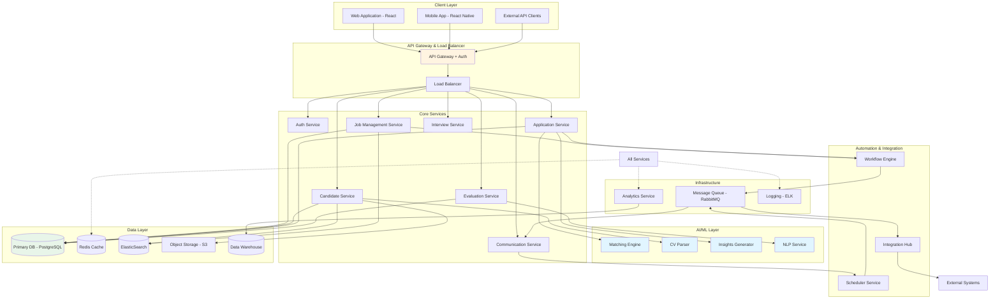
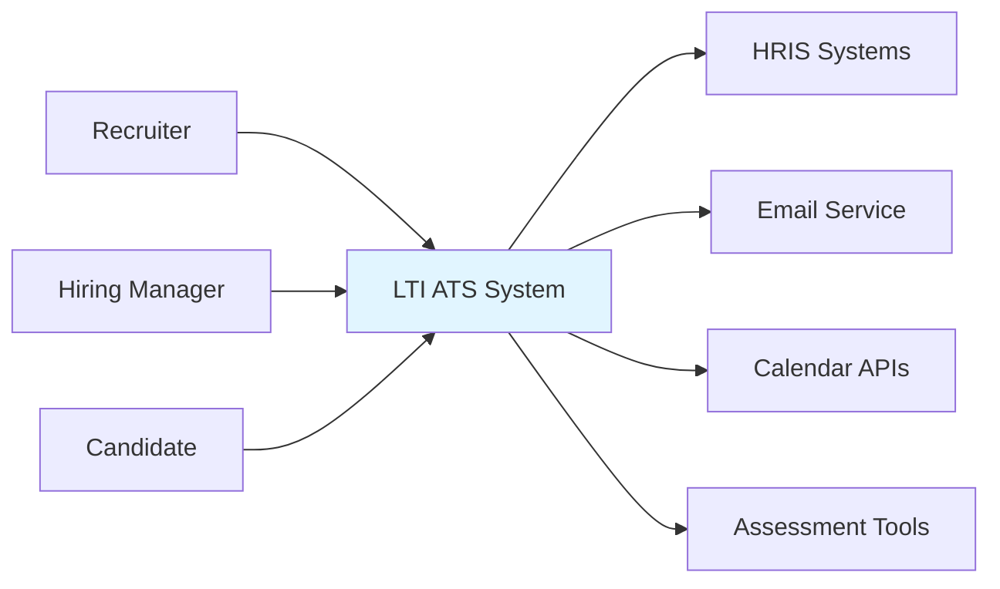
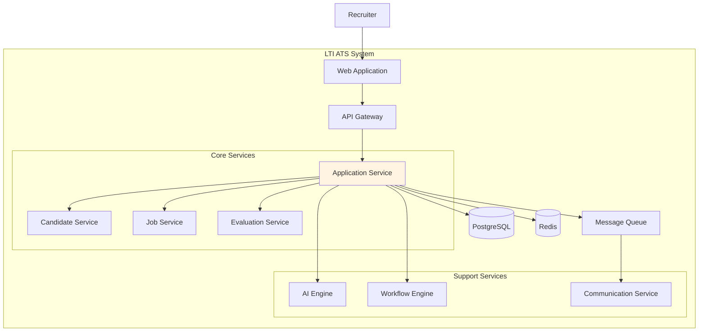

# LTI ATS - Sistema de Seguimiento de Candidatos
## Análisis y Diseño Arquitectónico

---

## 1. Descripción del Producto

### Visión General
LTI ATS es una plataforma de nueva generación para la gestión integral del ciclo de reclutamiento, diseñada para equipos de recursos humanos que buscan eficiencia, colaboración y decisiones basadas en datos. El sistema integra inteligencia artificial en cada fase del proceso de selección, desde la publicación de vacantes hasta la incorporación del candidato.

### Propuesta de Valor
El producto transforma el reclutamiento reactivo en un proceso proactivo e inteligente mediante:

- **Automatización inteligente** de tareas repetitivas (filtrado, clasificación, seguimiento)
- **Colaboración en tiempo real** entre reclutadores, hiring managers y stakeholders
- **IA asistida** para matching candidato-vacante, predicción de éxito y generación de insights
- **Experiencia unificada** que elimina herramientas fragmentadas y flujos manuales

### Diferenciadores Clave

1. **Motor de IA Contextual**: No solo filtra por keywords, sino que comprende el contexto del rol, la cultura organizacional y predice el fit del candidato mediante análisis semántico avanzado.

2. **Colaboración Nativa**: Comentarios en tiempo real, evaluaciones compartidas y workflows colaborativos integrados desde el diseño, no como añadido posterior.

3. **Automatización Adaptativa**: La IA aprende de las decisiones del equipo y ajusta automáticamente filtros, criterios de evaluación y recomendaciones.

4. **Analytics Predictivo**: Dashboard con métricas accionables, predicción de tiempo de cierre, análisis de embudo y detección temprana de cuellos de botella.

5. **Experiencia del Candidato**: Portal dedicado con actualizaciones en tiempo real, comunicación bidireccional y transparencia total del proceso.

---

## 2. Funcionalidades Clave

### 2.1 Gestión de Vacantes
- Creación de requisiciones con templates inteligentes
- Generación automática de descripciones de puesto optimizadas con IA
- Workflow de aprobación configurable
- Publicación multicanal (job boards, LinkedIn, redes sociales)
- Análisis de mercado y benchmarking salarial

### 2.2 Sourcing y Atracción
- Búsqueda booleana avanzada en base de datos interna
- Integración con LinkedIn Recruiter, Indeed, GitHub
- Chrome extension para importación rápida de perfiles
- Nurturing automático de talento pasivo
- Talent pools segmentados por skills, experiencia y potencial

### 2.3 Screening Inteligente
- Parsing automático de CVs con extracción de datos estructurados
- Scoring automático basado en criterios del puesto
- Análisis de compatibilidad cultural mediante NLP
- Filtros dinámicos con aprendizaje continuo
- Detección de red flags y verificación de inconsistencias

### 2.4 Evaluación Colaborativa
- Matriz de evaluación personalizable por rol
- Comentarios y ratings en tiempo real
- Video entrevistas asíncronas con análisis de sentimiento
- Pruebas técnicas integradas (coding challenges, assessments)
- Scorecards estructurados con ponderación automática

### 2.5 Gestión de Pipeline
- Kanban visual con drag-and-drop
- Workflows automatizados por etapa
- Asignación inteligente de candidatos a reclutadores
- Alertas proactivas de candidatos estancados
- Bulk actions para gestión eficiente

### 2.6 Comunicación
- Templates de email personalizables con merge fields
- Envíos automatizados triggered por eventos
- Chatbot con IA para FAQs de candidatos
- Agendamiento inteligente de entrevistas (detección de disponibilidad)
- SMS y WhatsApp para notificaciones críticas

### 2.7 Analytics e Insights
- Dashboard ejecutivo con KPIs del funnel
- Análisis de fuentes de reclutamiento (ROI por canal)
- Time-to-hire por etapa y cuello de botella
- Diversidad e inclusión metrics
- Predicción de abandono de candidatos
- Reportes personalizables exportables

### 2.8 Integraciones
- HRIS (BambooHR, Workday, SAP SuccessFactors)
- Calendar (Google, Outlook, Office 365)
- Communication (Slack, Teams, Gmail)
- Background checks (Checkr, Sterling)
- Assessment tools (Codility, HackerRank)
- API RESTful para integraciones custom

---

## 3. Lean Canvas

| **Bloque** | **Contenido** |
|------------|---------------|
| **Problema** | 1. Procesos de reclutamiento lentos y manuales<br>2. Falta de colaboración efectiva entre stakeholders<br>3. Decisiones de contratación subjetivas sin datos<br>4. Herramientas fragmentadas y flujos desconectados<br>5. Experiencia del candidato deficiente |
| **Segmentos de Clientes** | **Early Adopters**: Startups tech (50-200 empleados), equipos de HR progresivos<br>**Mercado Principal**: Empresas mid-market (200-2000 empleados)<br>**Segmento Secundario**: Agencias de reclutamiento especializadas |
| **Propuesta de Valor Única** | ATS con IA que reduce el time-to-hire en 40% mediante automatización inteligente y colaboración en tiempo real, permitiendo a HR enfocarse en decisiones estratégicas en lugar de tareas administrativas |
| **Solución** | 1. Motor de IA para matching y scoring automatizado<br>2. Plataforma colaborativa con comentarios en tiempo real<br>3. Workflows inteligentes y adaptables<br>4. Analytics predictivo con insights accionables<br>5. Portal del candidato con experiencia moderna |
| **Canales** | - Marketing de contenidos (blog, webinars, whitepapers)<br>- SEO y SEM especializado en HR tech<br>- Partnerships con consultoras de HR<br>- Freemium model con trial extendido<br>- Eventos y conferencias de RRHH |
| **Flujos de Ingresos** | - SaaS por suscripción (tier por usuarios activos)<br>- Premium features (IA avanzada, integraciones enterprise)<br>- Professional services (implementación, training)<br>- Marketplace de integraciones (revenue share) |
| **Estructura de Costos** | - Infraestructura cloud (AWS/GCP)<br>- Desarrollo y producto (equipo engineering)<br>- Costos de IA/ML (API calls, training models)<br>- Sales y marketing<br>- Customer success y soporte |
| **Métricas Clave** | - MRR y ARR growth<br>- Churn rate < 5% anual<br>- NPS > 50<br>- Time-to-value < 30 días<br>- Reducción time-to-hire promedio (benchmark vs competencia)<br>- Adoption rate de features de IA |
| **Ventaja Injusta** | - Algoritmos propietarios de matching con aprendizaje continuo<br>- Dataset de patrones de contratación exitosa<br>- Equipo fundador con experiencia combinada en HR tech y ML<br>- Red de partnerships con líderes de la industria |

---

## 4. Casos de Uso Principales

### 4.1 Caso de Uso 1: Publicación y Sourcing de Vacante

**Actor Principal**: Recruiter  
**Actores Secundarios**: Hiring Manager, Sistema de IA, Job Boards Externos  

**Descripción**: Un reclutador crea una nueva vacante, la sistema genera automáticamente una descripción optimizada, obtiene aprobación del hiring manager y publica en múltiples canales mientras activa sourcing automatizado.

**Flujo Principal**:
1. Recruiter crea requisición seleccionando template o desde cero
2. Completa información básica (título, departamento, ubicación, salary range)
3. Sistema IA sugiere skills requeridos basándose en roles similares
4. IA genera descripción del puesto optimizada para SEO y atracción
5. Recruiter revisa, ajusta y envía para aprobación
6. Hiring Manager recibe notificación y aprueba vía workflow
7. Sistema publica automáticamente en job boards configurados
8. Sourcing engine activa búsqueda en talent pools y bases externas
9. IA realiza matching proactivo con candidatos potenciales
10. Recruiter recibe notificaciones de candidatos con high match score



---

### 4.2 Caso de Uso 2: Evaluación Colaborativa de Candidato

**Actor Principal**: Hiring Team (Recruiter, Hiring Manager, Interviewer)  
**Actores Secundarios**: Sistema de IA, Candidato  

**Descripción**: Múltiples stakeholders evalúan a un candidato de forma colaborativa con scorecards estructurados, comentarios en tiempo real y una recomendación final asistida por IA.

**Flujo Principal**:
1. Candidato completa entrevistas con diferentes miembros del equipo
2. Cada entrevistador accede al perfil del candidato en tiempo real
3. Completan scorecard específico según su área de evaluación
4. Añaden comentarios y observaciones cualitativas
5. Sistema agrega ratings automáticamente con ponderación configurada
6. IA analiza sentimiento de comentarios y detecta patrones
7. Genera recomendación basada en datos históricos de contrataciones exitosas
8. Hiring Manager accede a vista consolidada con todos los inputs
9. Team realiza debrief sincrónico con datos en vivo
10. Decisión final se registra con justificación y próximos pasos



---

### 4.3 Caso de Uso 3: Automatización de Comunicación y Avance

**Actor Principal**: Sistema Automatizado  
**Actores Secundarios**: Recruiter, Candidato  

**Descripción**: El sistema gestiona automáticamente la comunicación con candidatos, avanza pipeline según triggers configurados y escala acciones sin intervención manual.

**Flujo Principal**:
1. Candidato aplica a través de portal de careers
2. Sistema parsea CV y crea perfil estructurado
3. IA realiza screening inicial contra requisitos
4. Si pasa threshold, envía email de confirmación automático
5. Asigna candidato a recruiter según carga de trabajo y especialización
6. Programa follow-ups automáticos si no hay actividad en X días
7. Cuando recruiter mueve a siguiente etapa, trigger envía template correspondiente
8. Si candidato confirma disponibilidad, integra con calendar para agendar
9. Post-entrevista, solicita feedback automático al candidato
10. Si rechazo, envía email personalizado y añade a talent pool para futuras oportunidades



---

## 5. Modelo de Datos

### 5.1 Entidades Principales

#### **Job (Vacante)**
- `id`: UUID (PK)
- `title`: String
- `description`: Text
- `department_id`: UUID (FK)
- `hiring_manager_id`: UUID (FK)
- `location`: String
- `employment_type`: Enum (full-time, part-time, contract)
- `salary_range_min`: Decimal
- `salary_range_max`: Decimal
- `required_skills`: JSON Array
- `preferred_skills`: JSON Array
- `status`: Enum (draft, open, on-hold, closed)
- `requisition_number`: String
- `openings_count`: Integer
- `created_at`: Timestamp
- `published_at`: Timestamp
- `closed_at`: Timestamp

#### **Candidate (Candidato)**
- `id`: UUID (PK)
- `email`: String (Unique)
- `first_name`: String
- `last_name`: String
- `phone`: String
- `location`: String
- `resume_url`: String
- `linkedin_url`: String
- `portfolio_url`: String
- `years_of_experience`: Integer
- `current_company`: String
- `current_title`: String
- `skills`: JSON Array
- `education`: JSON Array
- `work_history`: JSON Array
- `source`: Enum (careers-page, referral, linkedin, agency)
- `gdpr_consent`: Boolean
- `created_at`: Timestamp
- `last_activity`: Timestamp

#### **Application (Aplicación)**
- `id`: UUID (PK)
- `job_id`: UUID (FK)
- `candidate_id`: UUID (FK)
- `stage_id`: UUID (FK)
- `assigned_recruiter_id`: UUID (FK)
- `ai_match_score`: Decimal (0-100)
- `overall_rating`: Decimal (1-5)
- `status`: Enum (active, hired, rejected, withdrawn)
- `applied_at`: Timestamp
- `last_stage_change`: Timestamp
- `rejection_reason_id`: UUID (FK, nullable)
- `offer_extended_at`: Timestamp (nullable)
- `offer_accepted_at`: Timestamp (nullable)

#### **Stage (Etapa del Pipeline)**
- `id`: UUID (PK)
- `job_id`: UUID (FK)
- `name`: String
- `order`: Integer
- `type`: Enum (screening, interview, assessment, offer)
- `automation_rules`: JSON
- `is_active`: Boolean

#### **Evaluation (Evaluación)**
- `id`: UUID (PK)
- `application_id`: UUID (FK)
- `evaluator_id`: UUID (FK)
- `stage_id`: UUID (FK)
- `scorecard_template_id`: UUID (FK)
- `overall_rating`: Decimal (1-5)
- `scores`: JSON (structured ratings)
- `comments`: Text
- `sentiment_score`: Decimal (nullable)
- `recommendation`: Enum (strong-yes, yes, maybe, no, strong-no)
- `submitted_at`: Timestamp

#### **User (Usuario del Sistema)**
- `id`: UUID (PK)
- `email`: String (Unique)
- `first_name`: String
- `last_name`: String
- `role`: Enum (admin, recruiter, hiring-manager, interviewer)
- `department_id`: UUID (FK)
- `is_active`: Boolean
- `permissions`: JSON Array
- `created_at`: Timestamp
- `last_login`: Timestamp

#### **Communication (Comunicación)**
- `id`: UUID (PK)
- `application_id`: UUID (FK)
- `sender_id`: UUID (FK, nullable para automático)
- `recipient_type`: Enum (candidate, internal)
- `channel`: Enum (email, sms, in-app)
- `template_id`: UUID (FK, nullable)
- `subject`: String
- `body`: Text
- `is_automated`: Boolean
- `sent_at`: Timestamp
- `opened_at`: Timestamp (nullable)
- `clicked_at`: Timestamp (nullable)

#### **AIInsight (Insight de IA)**
- `id`: UUID (PK)
- `entity_type`: Enum (application, job, candidate)
- `entity_id`: UUID
- `insight_type`: Enum (match-score, red-flag, prediction, recommendation)
- `confidence_score`: Decimal (0-100)
- `data`: JSON (structured insight data)
- `explanation`: Text
- `created_at`: Timestamp
- `acknowledged_by_user_id`: UUID (FK, nullable)

#### **Interview (Entrevista)**
- `id`: UUID (PK)
- `application_id`: UUID (FK)
- `stage_id`: UUID (FK)
- `interviewer_ids`: JSON Array (UUIDs)
- `scheduled_at`: Timestamp
- `duration_minutes`: Integer
- `location`: String (o meeting link)
- `type`: Enum (phone, video, on-site, asynchronous)
- `status`: Enum (scheduled, completed, cancelled, no-show)
- `meeting_notes`: Text
- `recording_url`: String (nullable)
- `completed_at`: Timestamp (nullable)

### 5.2 Relaciones Principales



---

## 6. Arquitectura de Alto Nivel

### 6.1 Visión General

La arquitectura de LTI ATS sigue un patrón de microservicios con event-driven architecture para garantizar escalabilidad, resiliencia y evolución independiente de componentes.

### 6.2 Principios Arquitectónicos

1. **Separation of Concerns**: Cada servicio tiene responsabilidad única y bien definida
2. **API-First**: Todos los servicios exponen APIs RESTful con OpenAPI specs
3. **Event-Driven**: Comunicación asíncrona vía message broker para operaciones no-críticas
4. **CQRS**: Separación de modelos de lectura y escritura para optimización
5. **Observability**: Logging, monitoring y tracing distribuido desde el diseño
6. **Security by Design**: Zero-trust, autenticación en cada capa, encriptación end-to-end

### 6.3 Diagrama de Arquitectura



### 6.4 Componentes Clave

#### **API Gateway**
- Punto de entrada único para todos los clientes
- Autenticación y autorización (JWT)
- Rate limiting y throttling
- Request routing y composition
- API versioning

#### **Core Services**
- **Auth Service**: Gestión de usuarios, autenticación, permisos RBAC
- **Job Management**: CRUD de vacantes, workflow de aprobación, publicación
- **Candidate Service**: Perfiles de candidatos, sourcing, talent pools
- **Application Service**: Pipeline, transiciones de estado, asignaciones
- **Evaluation Service**: Scorecards, ratings, decisiones colaborativas
- **Communication Service**: Templating, envío multi-canal, tracking
- **Interview Service**: Scheduling, calendar sync, feedback collection

#### **AI/ML Layer**
- **Matching Engine**: Algoritmo propietario de scoring candidato-vacante
- **CV Parser**: Extracción de datos estructurados de documentos
- **Insights Generator**: Predicciones, recomendaciones, detección de patrones
- **NLP Service**: Análisis de sentimiento, extracción de entities

#### **Automation & Integration**
- **Workflow Engine**: Orquestación de procesos, reglas de negocio
- **Scheduler**: Jobs recurrentes, follow-ups, reminders
- **Integration Hub**: Conectores a sistemas externos, webhooks

#### **Data Layer**
- **PostgreSQL**: Base de datos transaccional principal
- **Redis**: Cache distribuido, sesiones
- **ElasticSearch**: Búsqueda full-text, faceted search
- **S3**: Almacenamiento de CVs, attachments
- **Data Warehouse**: Analytics histórico, reporting

---

## 7. Diagrama C4 - Application Service (Componente Crítico)

El **Application Service** es el corazón del sistema, gestionando todo el ciclo de vida de las aplicaciones desde que el candidato aplica hasta la decisión final.

### Nivel 1 - Contexto



### Nivel 2 - Contenedor



### Nivel 3 - Componentes (Application Service)

```mermaid
graph TB
    subgraph "Application Service"
        API[REST API Controller]
        
        subgraph "Application Core"
            APP_MGR[Application Manager]
            PIPELINE[Pipeline Manager]
            STATE[State Machine]
            ASSIGNMENT[Assignment Engine]
        end
        
        subgraph "Business Logic"
            SCREENING[Screening Logic]
            TRANSITION[Transition Handler]
            BULK[Bulk Operations]
            RULES[Business Rules Engine]
        end
        
        subgraph "Integration Layer"
            AI_CLIENT[AI Service Client]
            WORKFLOW_CLIENT[Workflow Client]
            EVENT_PUB[Event Publisher]
            CACHE_MGR[Cache Manager]
        end
        
        REPO[Application Repository]
        METRICS[Metrics Collector]
    end
    
    EXT_API[API Gateway] --> API
    
    API --> APP_MGR
    API --> PIPELINE
    API --> BULK
    
    APP_MGR --> STATE
    APP_MGR --> ASSIGNMENT
    APP_MGR --> SCREENING
    
    PIPELINE --> TRANSITION
    PIPELINE --> RULES
    
    TRANSITION --> STATE
    TRANSITION --> WORKFLOW_CLIENT
    TRANSITION --> EVENT_PUB
    
    SCREENING --> AI_CLIENT
    ASSIGNMENT --> AI_CLIENT
    
    APP_MGR --> REPO
    PIPELINE --> REPO
    BULK --> REPO
    
    APP_MGR --> CACHE_MGR
    PIPELINE --> CACHE_MGR
    
    APP_MGR --> METRICS
    PIPELINE --> METRICS
    